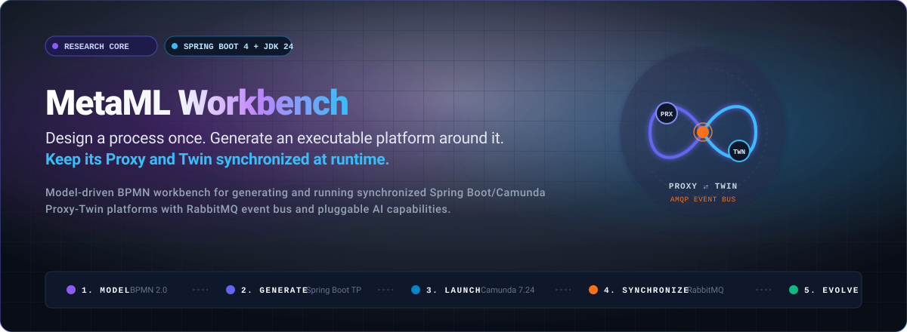
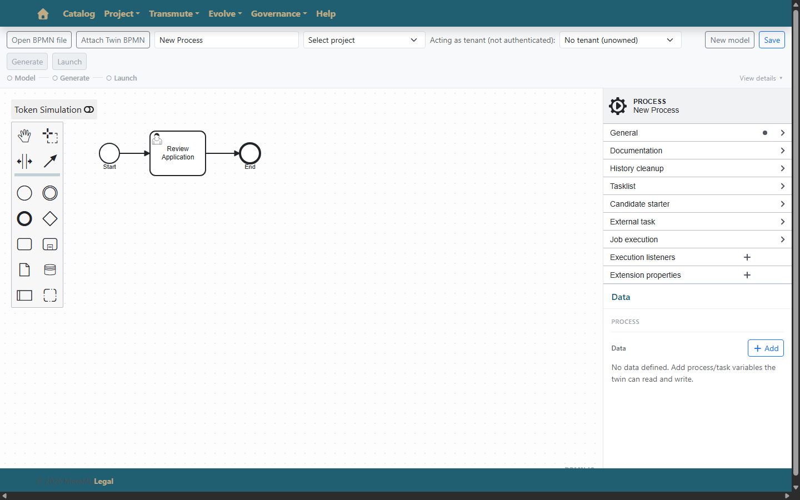
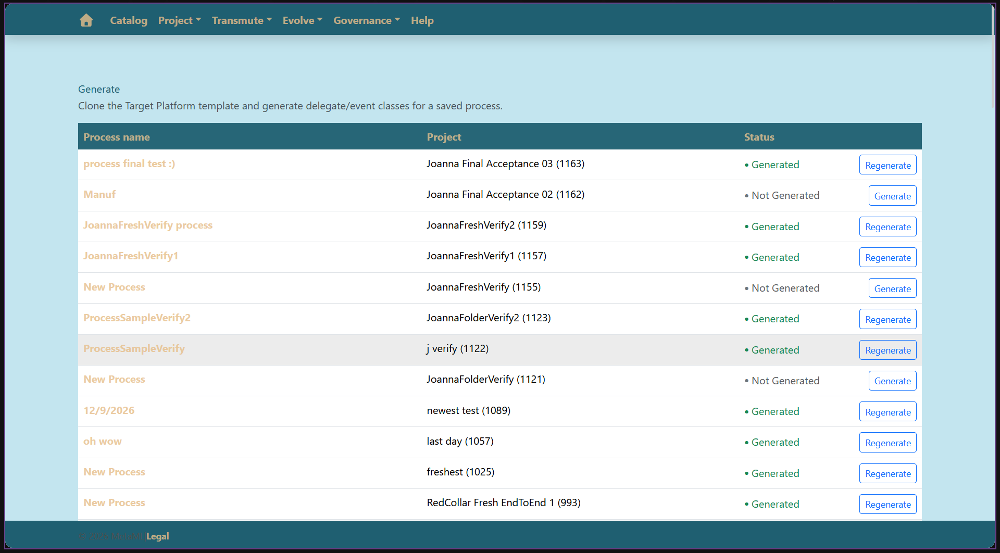
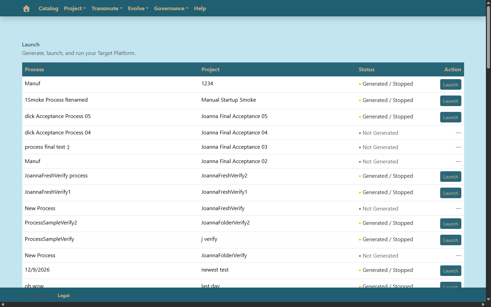
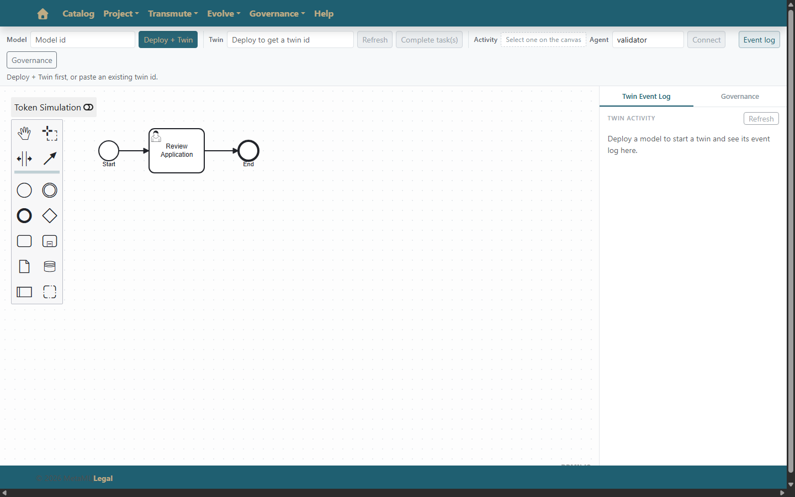

# MetaML Workbench

<p align="center">
  
</p>

<p align="center">
  <a href="https://adoptium.net/"></a>
  <a href="https://spring.io/projects/spring-boot"></a>
  <a href="https://camunda.com/"></a>
  <a href="https://www.rabbitmq.com/"></a>
  <a href="https://react.dev/"></a>
  <a href="https://www.omg.org/spec/BPMN/2.0/"></a>
  <a href="https://maven.apache.org/"></a>
</p>

> **Design a process once. Generate an executable platform around it. Keep its Proxy and Twin synchronized at runtime.**
>
> MetaML Workbench is a model-driven development platform and runtime supervisor for authoring BPMN 2.0 process models and compiling them into dedicated, standalone Spring Boot microservices. Each generated Target Platform integrates Camunda 7 workflow orchestration, pluggable capability bindings, and real-time AMQP event synchronization between outward-facing Proxy delegates and operational Digital Twins.

---

## Runtime Flow at a Glance

<p align="center">
  
</p>

The platform transitions seamlessly from visual workflow specification to isolated microservice execution and event-driven lockstep synchronization:

1. **BPMN 2.0 Authoring**: Design or import executable business workflows via the React modeling canvas.
2. **Platform Scaffolding**: Transform process definitions into an isolated Spring Boot Target Platform with customized identity and ports.
3. **Managed Execution**: Launch the generated application as a supervised child JVM with automated health probing.
4. **Proxy & Capability Delegation**: Execute outward-facing service tasks via decoupled capability bindings and pluggable AI agents.
5. **AMQP Event Synchronization**: Emit transactional state changes to RabbitMQ topic exchanges to drive correlated Digital Twins in lockstep.

---

## From Model to Running Platform

<p align="center">
  
</p>

| Stage | Subsystem | Description |
| :--- | :--- | :--- |
| **1. Model** | `frontend` / `bpmn-js` | Author or import standard BPMN 2.0 XML workflows with visual canvas, component palette, and token simulation. |
| **2. Generate** | `workbench` / `wbapi` | Clone the production Target Platform template, specialize Maven coordinates, configure AMQP topology, and inject process definitions. |
| **3. Launch** | `workbench` / Child JVM | Build and launch the scaffolded platform on an assigned dynamic port with background health check supervision. |
| **4. Execute** | `capability-core` / `providers` | Proxy service tasks delegate business logic to external REST endpoints, local providers, or pluggable AI agents. |
| **5. Synchronize** | `RabbitMQ` / `RedCollarTP` | Correlated event bus maintains runtime state lockstep between the outward Proxy and the shadow Digital Twin. |

---

## Architecture Overview

<p align="center">
  
</p>

### System Topology

- **Client Tier (`frontend/`)**: React 18 single-page application (port 3000) providing the BPMN modeler canvas (`bpmn-js`), Transmute Studio (Model, Generate, Launch), and the Evolve agent catalog.
- **Control Plane (`backend/`)**:
  - **`wbapi` (Port 8082)**: Spring Boot REST API orchestrating project persistence, BPMN model versioning, validation, and generation endpoints.
  - **`workbench`**: Core generation engine (`SpringBootProjectGenerator`) providing identity specialization, template instantiation, and child JVM process management (`ProcessLauncher`).
  - **`nodemanager` (Port 8083)**: Dynamic agent discovery and capability catalog stub for extensible runtime tools.
- **Generated Target Platform (`generated-target-platforms/`)**: Standalone Spring Boot 4.1.0 / Java 24 application hosting an embedded Camunda 7.24.0 process engine, bundled Maven Wrapper, and independent HTTP port.
- **AMQP Event Broker (`RabbitMQ`)**: RabbitMQ message broker (AMQP port 5672, management port 15672) delivering topic exchange routing for Proxy-to-Twin state propagation.
- **Proxy ⇄ Digital Twin Runtime**: Outward-facing Proxy process instances execute real business operations and emit state events; correlated Digital Twin instances mirror execution in shadow lockstep.

---

## Key Capabilities

<table>
  <tr>
    <td width="50%" valign="top">
      <h3>Model-Driven Generation</h3>
      <p>Transform standard BPMN 2.0 XML models into standalone Spring Boot microservices. Scaffolding automatically configures Camunda process engines, specializes Maven <code>pom.xml</code> artifacts, binds dynamic server ports, and bundles a standalone Maven Wrapper.</p>
    </td>
    <td width="50%" valign="top">
      <h3>Real Runtime Execution</h3>
      <p>Decouple process orchestration from implementation details. The <code>capability-core</code> and <code>reference-providers</code> modules supply structured input/output contracts, invocation contexts, and pluggable service task bindings.</p>
    </td>
  </tr>
  <tr>
    <td width="50%" valign="top">
      <h3>Proxy / Twin Synchronization</h3>
      <p>Execute parallel Proxy and Twin workflows correlated by <code>businessKey</code> and <code>correlationId</code>. Real-time AMQP messaging over RabbitMQ guarantees state lockstep, enabling non-intrusive runtime auditing and shadow simulation.</p>
    </td>
    <td width="50%" valign="top">
      <h3>Extensible AI &amp; Agent Architecture</h3>
      <p>Incorporate intelligent autonomous agents directly into process task flows. The Node Manager service provides dynamic capability discovery, tool catalog exposure, and runtime schema evaluation for evolving platforms.</p>
    </td>
  </tr>
</table>

---

## Product Screenshots

<table>
  <tr>
    <td width="50%" align="center">
      <br>
      <b>BPMN 2.0 Modeler</b><br>
      <sub>Visual process modeling, XML import/export, and interactive canvas authoring.</sub>
    </td>
    <td width="50%" align="center">
      <br>
      <b>Target Platform Scaffolding</b><br>
      <sub>One-click transformation of process definitions into complete Spring Boot applications.</sub>
    </td>
  </tr>
  <tr>
    <td width="50%" align="center">
      <br>
      <b>Process Supervision Dashboard</b><br>
      <sub>Supervise child JVM lifecycles, health status, and direct Camunda Cockpit links.</sub>
    </td>
    <td width="50%" align="center">
      <br>
      <b>Capabilities &amp; Agent Catalog</b><br>
      <sub>Dynamic capability discovery, agent bindings, and runtime schema governance.</sub>
    </td>
  </tr>
</table>

---

## Quick Start

```
Clone Repository ➔ Build Backend Modules ➔ Start Workbench API ➔ Start Frontend ➔ Model & Generate ➔ Launch
```

### 1. Requirements

- **Java JDK 24 or newer**: Required to build and run Workbench services (`wbapi`, `workbench`, `nodemanager`) and generated Target Platforms (tested with Adoptium Temurin 25 / target release 24).
- **Node.js (v18+) and npm**: Required for the React web application.
- **Git**: Required for version control and workspace management.
- **Docker**: Recommended for running RabbitMQ locally.
- **RabbitMQ**: Required when utilizing Proxy/Twin AMQP event synchronization. *(Optional for basic Workbench modeling and standalone code generation).*
- **Maven**: The repository bundles the Maven Wrapper (`mvnw`, `mvnw.cmd`) in `backend/` and within every generated Target Platform.

---

### 2. Initial Backend Build (Fresh Clone)

On a fresh clone, install the core backend modules into your local Maven repository (`~/.m2/repository`) so that shared libraries (`capability-core`, `reference-providers`, `workbench`) are available to dependent services and generated platforms:

- **Windows PowerShell:**
  ```powershell
  cd backend
  .\mvnw.cmd install -DskipTests
  ```
- **Linux / macOS:**
  ```bash
  cd backend
  ./mvnw install -DskipTests
  ```

*(On Windows, `backend\run-wbapi.cmd` is also provided as a convenience script to install dependencies and boot the backend).*

---

### 3. Start Workbench REST API

The primary backend service (`wbapi`) runs on port **8082**:

- **Windows PowerShell:**
  ```powershell
  cd backend
  .\mvnw.cmd -pl wbapi spring-boot:run
  ```
- **Linux / macOS:**
  ```bash
  cd backend
  ./mvnw -pl wbapi spring-boot:run
  ```

Verify API availability: [http://localhost:8082/api/v1/projects/all](http://localhost:8082/api/v1/projects/all)

---

### 4. Start Frontend Web Interface

The React web application runs on port **3000**:

```bash
cd frontend
npm install
npm start
```

Open [http://localhost:3000](http://localhost:3000) in your browser.

---

### 5. Start RabbitMQ (For Proxy / Twin Synchronization)

RabbitMQ routes AMQP events between Proxy delegates and Digital Twin instances:

```bash
# Start container with management console
docker run -d --name metaml-rabbitmq -p 5672:5672 -p 15672:15672 rabbitmq:3-management

# Subsequent starts
docker start metaml-rabbitmq
```

Management console: [http://localhost:15672](http://localhost:15672) *(default credentials: `guest` / `guest`)*.

---

### 6. Start Node Manager (Optional — For Evolve & Agent Catalog)

The Node Manager service (`nodemanager`) runs on port **8083** to provide dynamic agent tool discovery:

- **Windows PowerShell:**
  ```powershell
  cd backend
  .\mvnw.cmd -pl nodemanager spring-boot:run
  ```
- **Linux / macOS:**
  ```bash
  cd backend
  ./mvnw -pl nodemanager spring-boot:run
  ```

---

## Basic Workflow

1. **Project Setup**: Create a new project under **Project > Create** or open an existing workspace via **Project > Edit**.
2. **Model**: Open the visual canvas under **Transmute > Model**. Author new workflow diagrams or import an existing `.bpmn` XML file.
3. **Save**: Click **Save** to persist the workflow definition and register the process with the Workbench engine.
4. **Generate**: Navigate to **Transmute > Generate**, select the process model, and click **Generate** to scaffold an isolated Spring Boot Target Platform.
5. **Launch**: Navigate to **Transmute > Launch** to build, supervise, and inspect the running platform.

---

## Launching a Target Platform

The **Transmute > Launch** dashboard manages the execution lifecycle of generated platforms:

```
Generated / Stopped
        │
      Launch
        ▼
     Running
        │
   ┌────┴─────────────────────────┐
   ▼                              ▼
[Open Platform] [Open Cockpit] [Stop]
```

- **Launch**: Starts the Target Platform as a supervised child JVM process on an automatically selected free port.
- **Running Status**: Once the application passes health checks, status transitions to `Running` and exposes direct controls:
  - **Open Platform**: Launches the root web endpoint (`http://127.0.0.1:<port>/`).
  - **Open Cockpit**: Directly accesses the embedded Camunda Cockpit (`http://localhost:<port>/camunda/app/cockpit/engine/`).
  - **Stop**: Terminates the child process tree and safely releases network bindings.
- **Runtime Introspection**: Expanding a running project row displays active runtime metadata, process keys, business keys, and dynamic ports.

---

## Running a Generated Target Platform Separately

Generated Target Platforms are completely standalone Spring Boot microservices bundling their own Maven Wrapper (`mvnw`, `mvnw.cmd`, `.mvn/wrapper/`).

### Output Directory Locations

- **Dynamically Generated Platforms**: By default, applications generated from the Workbench backend are written to `../generated-target-platforms/` (a sibling directory outside the repository root).
- **Tracked Reference Platforms**: The repository includes sample reference platforms in `generated-target-platforms/` (such as `redcollar-manufacturing` and `liveverify-wiretransfer`).

### Local Dependencies

Generated platforms depend on `capability-core` and `reference-providers`. Ensure `mvnw install -DskipTests` has been executed in `backend/` so these artifacts reside in your local Maven repository.

### Manual Execution

1. Navigate to the generated project directory:
   ```bash
   cd <path-to-generated-platform>
   ```

2. Compile the application:
   - **Windows PowerShell:**
     ```powershell
     .\mvnw.cmd clean compile
     ```
   - **Linux / macOS:**
     ```bash
     ./mvnw clean compile
     ```

3. Run the application:
   - **Windows PowerShell:**
     ```powershell
     .\mvnw.cmd spring-boot:run
     ```
   - **Linux / macOS:**
     ```bash
     ./mvnw spring-boot:run
     ```

4. Access the application:
   - **Application Root**: `http://localhost:8080` (or the configured `SERVER_PORT`)
   - **Camunda Cockpit**: `http://localhost:8080/camunda` *(default credentials: `demo` / `demo`)*

---

## Proxy / Twin Runtime & AMQP Synchronization

Generated platforms implement a synchronized Proxy/Twin architectural pattern:

- **Proxy Engine**: Outward-facing execution delegates and service tasks that handle live requests, trigger external REST capabilities, and emit process progression events.
- **Digital Twin**: Operational shadow replica kept in lockstep with the primary process via AMQP intermediate catch events, enabling runtime safety checks and simulation without side effects.
- **AMQP Event Bus**: Configured topic exchanges in RabbitMQ decouple event producers and consumers. Process events include `processDefinitionKey`, `businessKey`, `activityId`, and execution payloads.
- **Introspection Endpoints**: Dedicated REST controllers provide process health, execution history, and state verification.

---

## Testing

### Backend Test Suite

Run unit and integration tests across all backend modules:

- **Windows PowerShell:**
  ```powershell
  cd backend
  .\mvnw.cmd test
  ```
- **Linux / macOS:**
  ```bash
  cd backend
  ./mvnw test
  ```

### Frontend Test Suite

Run the React test suite (including Model, Generate, and Launch page tests):

```bash
cd frontend
npm test -- --watchAll=false
```

---

## Repository Structure

```
metaml-workbench-source-of-truth/
├── backend/
│   ├── wbapi/                  # Spring Boot REST API & Workbench entry point (:8082)
│   ├── workbench/              # Codegen engine, BPMN transforms, ProcessLauncher
│   ├── capability-core/        # Shared capability contracts & execution context
│   ├── providers/              # Reference capability provider implementations
│   ├── nodemanager/            # Node Manager service stub & agent catalog (:8083)
│   └── RedCollarTP/            # Canonical Spring Boot + Camunda template scaffold
├── frontend/                   # React 18 SPA with bpmn-js canvas (:3000)
├── generated-target-platforms/ # Tracked sample generated Target Platform applications
├── demo/                       # BPMN process fixtures, test datasets, verification files
└── docs/
    ├── architecture/           # Architecture specs, ADRs, and runtime diagrams
    └── assets/                 # SVGs, animations, and product screenshots
        ├── metaml-hero.svg
        ├── metaml-flow.gif
        ├── metaml-lifecycle.svg
        ├── metaml-architecture.svg
        └── screenshots/
            ├── modeler.png
            ├── generate.png
            ├── launch.png
            └── evolve.png
```

---

## Additional Components & Further Reading

- **VS Code Extension**: The MetaML VS Code extension is maintained in the sibling repository `metaml-vscode-plugin`. It communicates with the Workbench REST API for target platform discovery, lifecycle commands, and AI-assisted process evolution.
- [Platform Context](PLATFORM_CONTEXT.md): High-level system overview and architectural context.
- [Architecture Specification](docs/architecture/ARCHITECTURE.md): Comprehensive component model, pipeline stages, and boundaries.
- [Documentation Index](docs/architecture/README.md): Master guide to architecture documentation.
- [Runtime Diagrams](docs/architecture/DIAGRAMS.md): Sequence and component interaction diagrams.
- [Architecture Decision Records (ADRs)](docs/architecture/adr/): Recorded architecture and design decisions.
