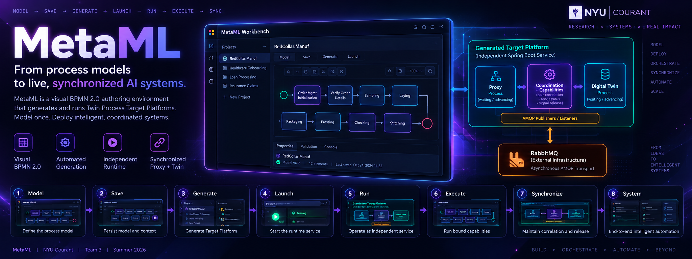
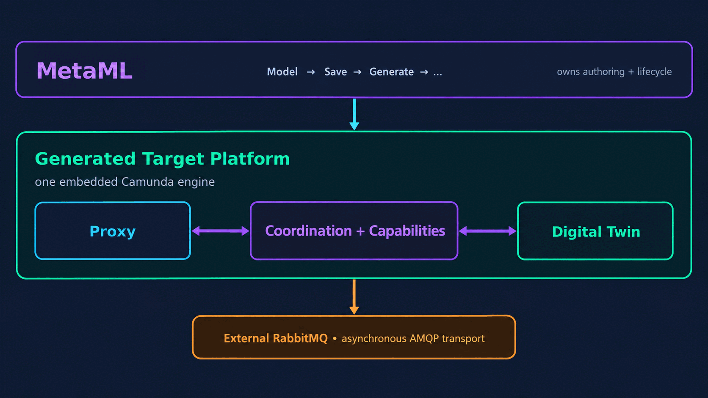
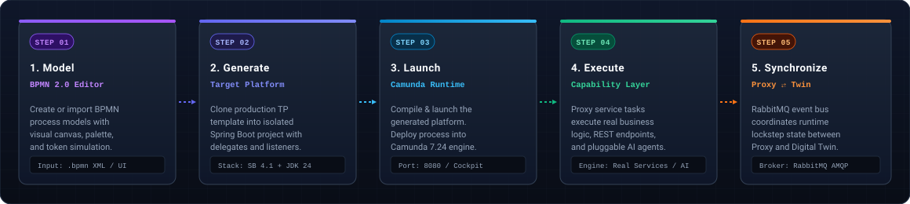
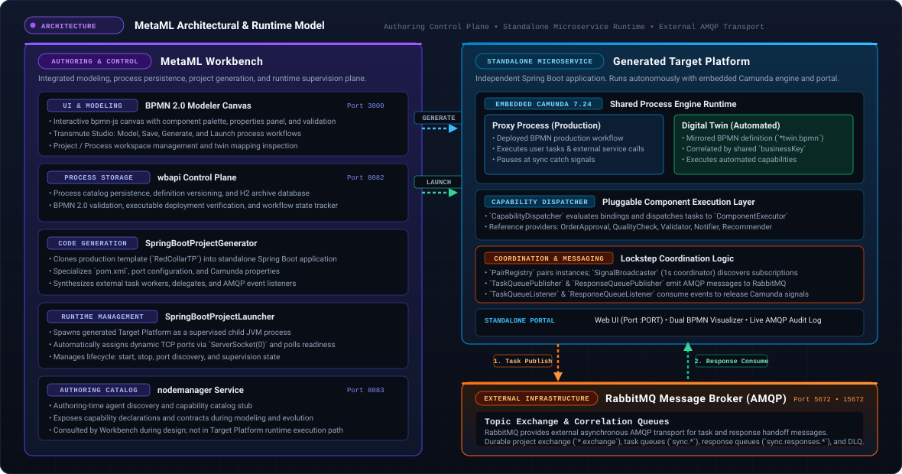
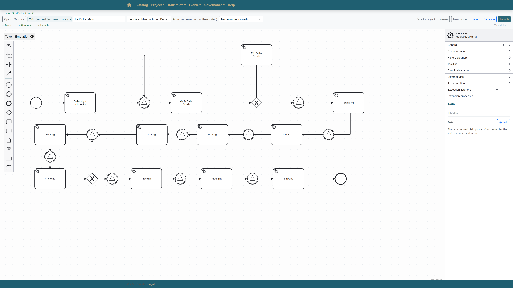
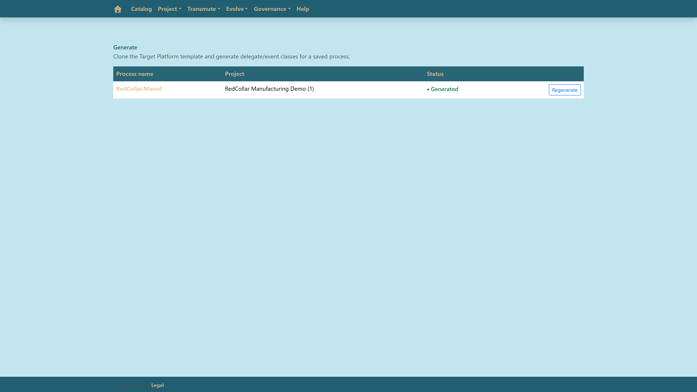
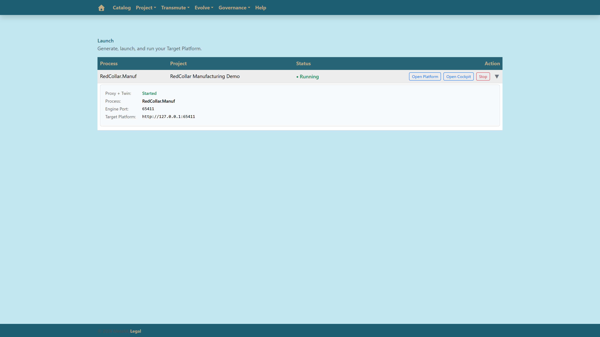
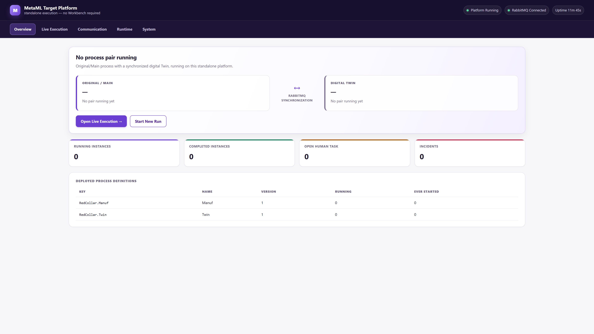

# MetaML

<p align="center">
  
</p>

<p align="center">
  <a href="https://adoptium.net/"></a>
  <a href="https://spring.io/projects/spring-boot"></a>
  <a href="https://camunda.com/"></a>
  <a href="https://www.rabbitmq.com/"></a>
  <a href="https://react.dev/"></a>
  <a href="https://www.omg.org/spec/BPMN/2.0/"></a>
  <a href="https://maven.apache.org/"></a>
</p>

> **Model-driven infrastructure for executable, synchronized process systems.**
>
> Model processes, generate executable Target Platforms, and coordinate Proxy/Twin execution through event-driven runtime infrastructure. The MetaML authoring environment (MetaML Workbench) provides visual BPMN 2.0 modeling, process persistence, project generation, and runtime management. Each generated Target Platform runs independently of the Workbench at runtime as a dedicated Spring Boot microservice containing the Proxy/Twin process runtime, capability execution, and external RabbitMQ integration.

---

## Runtime Flow at a Glance

<p align="center">
  
</p>

The platform transitions seamlessly from visual workflow specification to isolated microservice execution and event-driven Proxy/Twin synchronization:

1. **Model**: Author or inspect BPMN workflows on the MetaML visual canvas.
2. **Save**: Validate the executable BPMN definition and persist the process in the MetaML catalog.
3. **Generate**: Compile the saved process into a dedicated Spring Boot Target Platform project with Camunda, runtime code, and messaging integration.
4. **Launch**: Build and start the generated Target Platform as a supervised child JVM on an assigned dynamic port.
5. **Run**: Execute correlated Proxy and Digital Twin workflows inside the Target Platform's single embedded Camunda engine.
6. **Execute**: Dispatch bound capabilities such as rules, services, tools, or agents from process activities through the capability runtime.
7. **Synchronize**: Target Platform runtime logic coordinates Proxy/Twin rendezvous and release, while external RabbitMQ transports task and response handoff messages.
8. **System**: MetaML owns modeling, persistence, generation, and launch; the generated Target Platform owns runtime execution; RabbitMQ remains external transport.

---

## From Model to Running Platform

<p align="center">
  
</p>

| Stage | Scope | Description | Runtime / Storage |
| :--- | :--- | :--- | :--- |
| **1. Model** | `MetaML` / Canvas | Visual workflow authoring and configuration on canvas with BPMN 2.0 elements, sequence flows, and properties. | Input: `.bpmn` XML / UI |
| **2. Save** | `MetaML` / Catalog | Validate executable BPMN structure and persist process definitions and versioned metadata to the catalog archive. | Storage: Process model file/archive stores + H2-backed metadata |
| **3. Generate** | `MetaML` / Engine | Scaffold an isolated Spring Boot microservice project pre-configured with Camunda 7.24, Maven wrapper, and AMQP bindings. | Output: Standalone Project Directory |
| **4. Launch** | `MetaML` / Supervisor | Build and start the generated application as a supervised child JVM process on an assigned dynamic port with live health probes. | Runtime: Child JVM Process / Dynamic Port |
| **5. Run** | `Target Platform` / Runtime | Execute correlated Proxy and Digital Twin workflows inside a single embedded Camunda engine, with external RabbitMQ providing asynchronous task/response transport. | Transport: RabbitMQ AMQP (`:5672`) |

---

## Architecture Overview

<p align="center">
  
</p>

### System Topology

- **MetaML Workbench (Host / Control Plane)**:
  - **UI & Modeler Canvas (Port 3000)**: React 18 single-page application providing the visual BPMN 2.0 modeling canvas (`bpmn-js`), Transmute Studio (Model, Generate, Launch), and the agent catalog.
  - **`wbapi` Control Plane (Port 8082)**: Spring Boot REST/API layer exposing project, model, generation, and launch endpoints while delegating core persistence, validation, generation, and runtime lifecycle operations to the `workbench` module. Workbench state and model metadata are persisted through H2-backed storage.
  - **`SpringBootProjectGenerator` (`workbench`)**: Core Target Platform generation engine responsible for specializing the selected process, instantiating the Target Platform template, copying / synthesizing BPMN and runtime sources, wiring Maven dependencies, and generating runtime configuration.
  - **`SpringBootProjectLauncher` (`workbench`)**: Generated Target Platform process supervisor responsible for dynamic port allocation, child JVM startup, readiness probing, runtime tracking, and termination.
  - **Catalog Subsystem (`nodemanager`, Port 8083)**: Authoring-time capability / agent discovery and catalog service used by the Workbench during modeling and evolution. It is not part of the generated Target Platform runtime path.

- **Generated Target Platform (Standalone Microservice :PORT)**:
  Runs independently of the Workbench at runtime after generation and compilation:
  - **Process Runtime**: Embedded Camunda 7.24 Engine executing both Proxy and Digital Twin process instances within the **same** engine.
  - **Correlated Workflows**: Proxy (primary outward-facing business workflow) ⇄ Digital Twin (automated shadow replica) correlated by `businessKey`.
  - **Capability Execution**: `CapabilityDispatcher` executing pluggable tasks (e.g., `OrderApproval`, `QualityCheck`, reference providers).
  - **Runtime Messaging**: Internal `SignalBroadcaster` (`@Scheduled` 1s coordinator), `PairRegistry` (maintains correlated `businessKey` mappings), and Task/Response queue publishers and listeners implementing the synchronization contract.
  - **Management Portal**: Standalone Web UI and Camunda Cockpit running on the microservice's dynamic port.

- **External RabbitMQ Broker (AMQP Port 5672, Mgmt 15672)**:
  - **Topic Exchange & Correlation Queues**: Routes task requests (`sync.<signal>`) and response messages (`sync.responses.<signal>`).
  - **Transport Role**: RabbitMQ provides external asynchronous AMQP transport for task and response handoff messages. Application logic inside the Target Platform (`PairRegistry`, `SignalBroadcaster`, Camunda signal events, and listeners) implements the synchronization contract.

---

## Key Capabilities

<table>
  <tr>
    <td width="50%" valign="top">
      <h3>Model-Driven Generation</h3>
      <p>Transform standard BPMN 2.0 XML models into standalone Spring Boot microservices. Scaffolding automatically configures Camunda process engines, specializes Maven <code>pom.xml</code> artifacts, binds dynamic server ports, and bundles a standalone Maven Wrapper.</p>
    </td>
    <td width="50%" valign="top">
      <h3>Real Runtime Execution</h3>
      <p>Decouple process orchestration from implementation details. The <code>capability-core</code> and <code>reference-providers</code> modules supply structured input/output contracts, invocation contexts, and pluggable service task bindings dispatched by <code>CapabilityDispatcher</code>.</p>
    </td>
  </tr>
  <tr>
    <td width="50%" valign="top">
      <h3>Proxy / Twin Synchronization</h3>
      <p>Execute correlated Proxy and Twin workflows inside a single embedded Camunda engine, linked by <code>businessKey</code>. External RabbitMQ provides AMQP transport for task and response handoff messages, while Target Platform runtime logic maintains Proxy/Twin correlation and synchronization across workflow turns.</p>
    </td>
    <td width="50%" valign="top">
      <h3>Extensible Capabilities &amp; Agents</h3>
      <p>Incorporate intelligent services, tools, and autonomous agents directly into process task flows. The Node Manager service provides an authoring-time agent catalog stub for dynamic tool discovery and schema exposure.</p>
    </td>
  </tr>
</table>

---

## RedCollar: From Model to Runtime

### 1. Model

Author and configure the canonical RedCollar garment manufacturing process on the MetaML canvas.

<p align="center">
  
</p>

<p align="center">↓</p>

### 2. Generate

Compile the validated RedCollar process model into an isolated, standalone Spring Boot Target Platform project.

<p align="center">
  
</p>

<p align="center">↓</p>

### 3. Launch

Start and supervise the generated RedCollar application on an assigned dynamic port with live health monitoring.

<p align="center">
  
</p>

<p align="center">↓</p>

### 4. Target Platform

The standalone generated RedCollar Target Platform running on its dynamic port with correlated Proxy/Twin execution and external RabbitMQ transport active.

<p align="center">
  
</p>

---

## Quick Start

```
Clone Repository ➔ Build Backend ➔ Start MetaML ➔ Model ➔ Save ➔ Generate ➔ Launch
```

### 1. Requirements

- **Java JDK 24 or newer**: Required to build and run MetaML backend services (`wbapi`, `workbench`, `nodemanager`) and generated Target Platforms (tested with Adoptium Temurin 25 / target release 24).
- **Node.js (v18+) and npm**: Required for the React web application.
- **Git**: Required for version control and workspace management.
- **Docker**: Recommended for running RabbitMQ locally.
- **RabbitMQ**: Required when utilizing Proxy/Twin AMQP event synchronization. *(Optional for basic modeling and standalone code generation).*
- **Maven**: The repository bundles the Maven Wrapper (`mvnw`, `mvnw.cmd`) in `backend/` and within every generated Target Platform.

---

### 2. Initial Backend Build (Fresh Clone)

On a fresh clone, install the core backend modules into your local Maven repository (`~/.m2/repository`) so that shared libraries (`capability-core`, `reference-providers`, `workbench`) are available to dependent services and generated platforms:

- **Windows PowerShell:**
  ```powershell
  cd backend
  .\mvnw.cmd install -DskipTests
  ```
- **Linux / macOS:**
  ```bash
  cd backend
  ./mvnw install -DskipTests
  ```

*(On Windows, `backend\run-wbapi.cmd` is also provided as a convenience script to install dependencies and boot the backend).*

---

### 3. Start MetaML REST API (wbapi)

The primary backend service (`wbapi`) runs on port **8082**:

- **Windows PowerShell:**
  ```powershell
  cd backend
  .\mvnw.cmd -pl wbapi spring-boot:run
  ```
- **Linux / macOS:**
  ```bash
  cd backend
  ./mvnw -pl wbapi spring-boot:run
  ```

Verify API availability: [http://localhost:8082/api/v1/projects/all](http://localhost:8082/api/v1/projects/all)

---

### 4. Start Frontend Web Interface

The React web application runs on port **3000**:

```bash
cd frontend
npm install
npm start
```

Open [http://localhost:3000](http://localhost:3000) in your browser.

---

### 5. Start RabbitMQ (For Proxy / Twin Synchronization)

RabbitMQ provides the external AMQP transport for task and response handoff messages used by correlated Proxy/Twin execution:

```bash
# Start container with management console
docker run -d --name metaml-rabbitmq -p 5672:5672 -p 15672:15672 rabbitmq:3-management

# Subsequent starts
docker start metaml-rabbitmq
```

Management console: [http://localhost:15672](http://localhost:15672) *(default credentials: `guest` / `guest`)*.

---

### 6. Start Node Manager (Optional — For Authoring Agent Catalog)

The Node Manager service (`nodemanager`) runs on port **8083** as an authoring-time agent catalog stub for dynamic tool discovery:

- **Windows PowerShell:**
  ```powershell
  cd backend
  .\mvnw.cmd -pl nodemanager spring-boot:run
  ```
- **Linux / macOS:**
  ```bash
  cd backend
  ./mvnw -pl nodemanager spring-boot:run
  ```

---

## Basic Workflow

1. **Project Setup**: Create a new project under **Project > Create** or open an existing workspace via **Project > Edit**.
2. **Model**: Open the visual canvas under **Transmute > Model**. Author new workflow diagrams or import an existing `.bpmn` XML file.
3. **Save**: Click **Save** to persist the workflow definition and register the process with the MetaML catalog.
4. **Generate**: Navigate to **Transmute > Generate**, select the process model, and click **Generate** to scaffold an isolated Spring Boot Target Platform.
5. **Launch**: Navigate to **Transmute > Launch** to build, supervise, and inspect the running platform.

---

## Launching a Target Platform

The **Transmute > Launch** dashboard manages the execution lifecycle of generated platforms:

```
Generated / Stopped
        │
      Launch
        ▼
     Running
        │
   ┌────┴─────────────────────────┐
   ▼                              ▼
[Open Platform] [Open Cockpit] [Stop]
```

- **Launch**: Starts the Target Platform as a supervised child JVM process on an automatically selected free port.
- **Running Status**: Once the application passes health checks, status transitions to `Running` and exposes direct controls:
  - **Open Platform**: Launches the root web endpoint (`http://127.0.0.1:<port>/`).
  - **Open Cockpit**: Directly accesses the embedded Camunda Cockpit (`http://localhost:<port>/camunda/app/cockpit/engine/`).
  - **Stop**: Terminates the child process tree and safely releases network bindings.
- **Runtime Introspection**: Expanding a running project row displays active runtime metadata, process keys, business keys, and dynamic ports.

---

## Running a Generated Target Platform Separately

Generated Target Platforms run independently of the Workbench at runtime after generation and build, operating as dedicated Spring Boot microservices bundling their own Maven Wrapper (`mvnw`, `mvnw.cmd`, `.mvn/wrapper/`).

### Output Directory Locations

- **Dynamically Generated Platforms**: By default, applications generated from MetaML are written to `../generated-target-platforms/` (a sibling directory outside the repository root).
- **Tracked Reference Platforms**: The repository includes sample reference platforms in `generated-target-platforms/` (such as `redcollar-manufacturing` and `liveverify-wiretransfer`).

### Local Dependencies

Generated platforms depend on `capability-core` and `reference-providers` at build time. Ensure `mvnw install -DskipTests` has been executed in `backend/` so these artifacts reside in your local Maven repository (`~/.m2/repository`). Synchronized task and response messaging requires external RabbitMQ.

### Manual Execution

1. Navigate to the generated project directory:
   ```bash
   cd <path-to-generated-platform>
   ```

2. Compile the application:
   - **Windows PowerShell:**
     ```powershell
     .\mvnw.cmd clean compile
     ```
   - **Linux / macOS:**
     ```bash
     ./mvnw clean compile
     ```

3. Run the application:
   - **Windows PowerShell:**
     ```powershell
     .\mvnw.cmd spring-boot:run
     ```
   - **Linux / macOS:**
     ```bash
     ./mvnw spring-boot:run
     ```

4. Access the application:
   - **Application Root**: `http://localhost:8080` (or the configured `SERVER_PORT`)
   - **Camunda Cockpit**: `http://localhost:8080/camunda` *(default credentials: `demo` / `demo`)*

---

## Proxy / Twin Runtime & AMQP Synchronization

Generated platforms implement a synchronized Proxy/Twin architectural pattern:

- **Same Embedded Engine**: Proxy and Digital Twin run as correlated BPMN process instances inside a single embedded Camunda engine within the generated Target Platform.
- **Proxy Process**: Outward-facing execution delegates and service tasks that handle live requests, trigger bound capabilities, and emit process progression events.
- **Digital Twin**: Automated counterpart correlated with the Proxy by `businessKey`, progressing through mirrored workflow turns under the Target Platform synchronization contract.
- **AMQP Transport**: RabbitMQ provides external asynchronous AMQP transport for task and response handoff messages. Topic exchanges decouple event producers and consumers.
- **Internal Synchronization Contract**: Target Platform application logic—including `PairRegistry` (tracking correlated `businessKey` instances), `SignalBroadcaster` (@Scheduled 1s poller), and Camunda signal events—enforces synchronization across workflow turns. Camunda intermediate signal catch events coordinate workflow rendezvous, while RabbitMQ transports asynchronous task and response handoff messages between synchronization turns.
- **Introspection Endpoints**: Dedicated REST controllers provide process health, execution history, and state verification.

---

## Testing

### Backend Test Suite

Run unit and integration tests across all backend modules:

- **Windows PowerShell:**
  ```powershell
  cd backend
  .\mvnw.cmd test
  ```
- **Linux / macOS:**
  ```bash
  cd backend
  ./mvnw test
  ```

### Frontend Test Suite

Run the React test suite (including Model, Generate, and Launch page tests):

```bash
cd frontend
npm test -- --watchAll=false
```

---

## Repository Structure

```
metaml-workbench-source-of-truth/
├── backend/
│   ├── wbapi/                  # Spring Boot REST API & Workbench entry point (:8082)
│   ├── workbench/              # Code generation, BPMN transforms, SpringBootProjectGenerator, SpringBootProjectLauncher
│   ├── capability-core/        # Shared capability contracts & execution context
│   ├── providers/              # Reference capability provider implementations
│   ├── nodemanager/            # Node Manager service stub & agent catalog (:8083)
│   └── RedCollarTP/            # Canonical Spring Boot + Camunda template scaffold
├── frontend/                   # React 18 SPA with bpmn-js canvas (:3000)
├── generated-target-platforms/ # Tracked sample generated Target Platform applications
├── demo/                       # BPMN process fixtures, test datasets, verification files
├── TEAM_DEMO_GUIDE.md          # Comprehensive step-by-step team demonstration guide
└── docs/
    ├── architecture/           # Architecture specs, ADRs, and runtime diagrams
    └── assets/                 # SVGs, animations, and product screenshots
        ├── metaml-hero.png
        ├── metaml-flow.gif
        ├── metaml-lifecycle.svg
        ├── metaml-architecture.svg
        └── screenshots/
            ├── redcollar-model.png
            ├── redcollar-generate.png
            ├── redcollar-launch.png
            └── redcollar-target-platform.png
```

---

## Additional Components & Further Reading

- **Team Demo Guide**: [TEAM_DEMO_GUIDE.md](TEAM_DEMO_GUIDE.md) — Comprehensive, end-to-end verification and demonstration walkthrough.
- **VS Code Extension**: The MetaML VS Code extension is maintained in the sibling repository `metaml-vscode-plugin`. It communicates with the Workbench REST API for target platform discovery, lifecycle commands, and AI-assisted process evolution.
- [Platform Context](PLATFORM_CONTEXT.md): High-level system overview and architectural context.
- [Architecture Specification](docs/architecture/ARCHITECTURE.md): Comprehensive component model, pipeline stages, and boundaries.
- [Documentation Index](docs/architecture/README.md): Master guide to architecture documentation.
- [Runtime Diagrams](docs/architecture/DIAGRAMS.md): Sequence and component interaction diagrams.
- [Architecture Decision Records (ADRs)](docs/architecture/adr/): Recorded architecture and design decisions.
