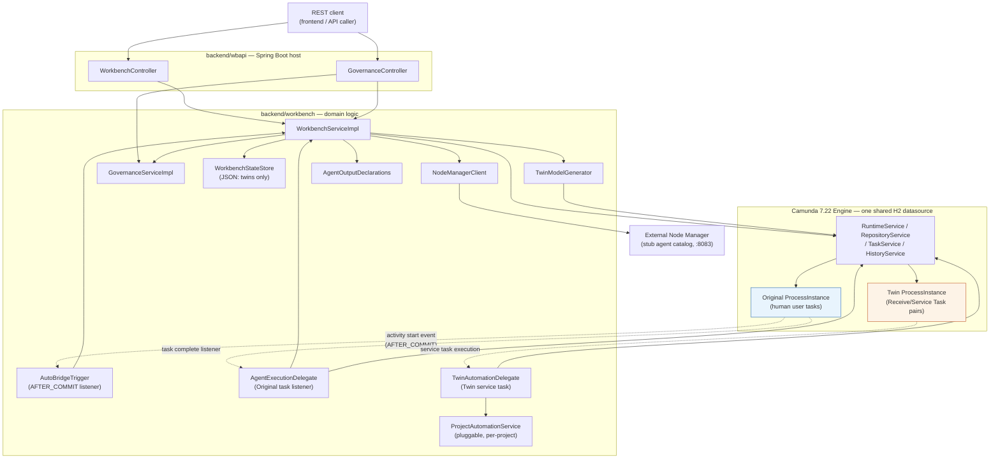
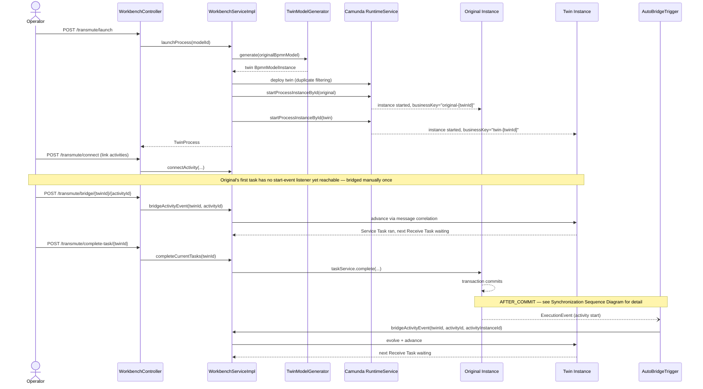
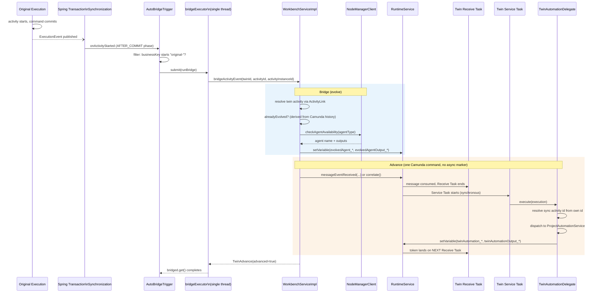
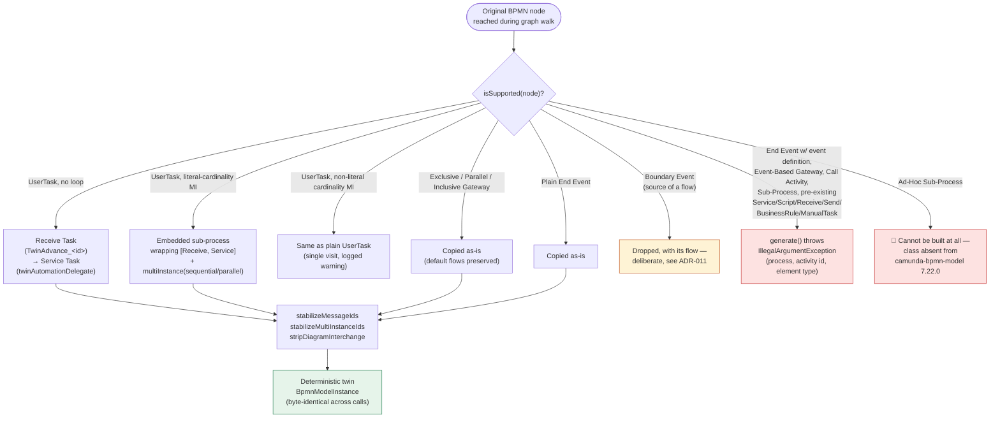
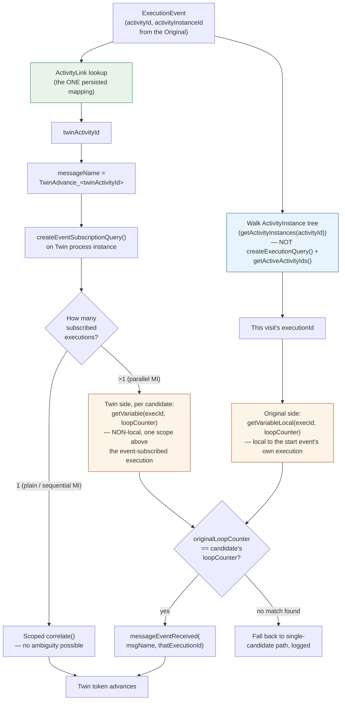
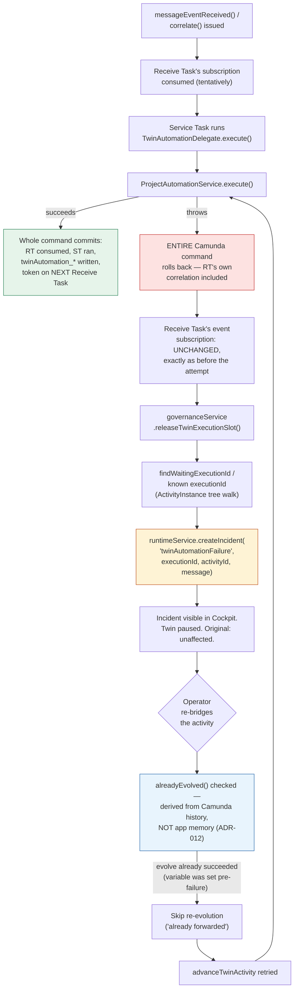
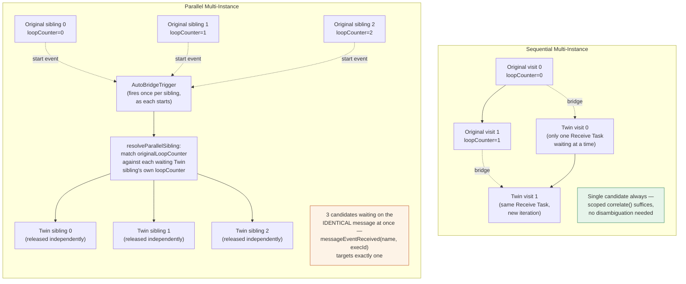

# Runtime Documentation Diagrams

Seven diagrams covering the runtime as implemented in Version 1.0. All render natively as GitHub-flavored Mermaid. Cross-referenced from [ARCHITECTURE.md](ARCHITECTURE.md).

---

## 1. Runtime Component Diagram

Every major class in the runtime and how they depend on each other, grouped by which side of the Original/Twin boundary they act on.

---

## 2. Runtime Sequence Diagram

The full lifecycle from launch through one synchronized step, in call order.

---

## 3. Synchronization Sequence Diagram

What happens between an Original commit and the Twin's next wait state, in full detail — the core mechanism this whole architecture is built around ([ADR-004](adr/ADR-004-event-driven-synchronization.md), [ADR-005](adr/ADR-005-receive-service-task-separation.md)).

---

## 4. BPMN Transformation Diagram

How `TwinModelGenerator` classifies and transforms every construct it encounters ([ADR-011](adr/ADR-011-unsupported-bpmn-construct-policy.md)).

---

## 5. Execution Identity Resolution Diagram

How "which specific visit, which execution, which loop iteration" gets answered fresh on every synchronization event — never cached, except the one `ActivityLink` mapping ([ADR-006](adr/ADR-006-runtime-derived-execution-identity.md)).

---

## 6. Failure Recovery Diagram

What happens when the Twin's automation throws, from the moment of failure through operator-driven recovery ([ADR-008](adr/ADR-008-incident-driven-failure-policy.md), [ADR-012](adr/ADR-012-restart-and-recovery-philosophy.md)).

---

## 7. Multi-Instance Synchronization Diagram

Sequential and parallel Multi-Instance, side by side — how N visits/siblings on the Original map to N visits/siblings on the Twin ([ADR-007](adr/ADR-007-execution-targeted-messaging.md), [ADR-010](adr/ADR-010-sequential-and-parallel-multi-instance-support.md)).

